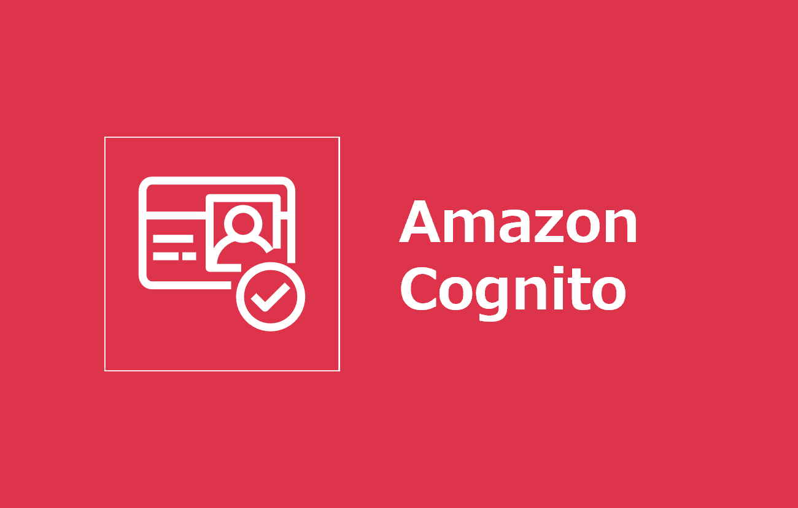
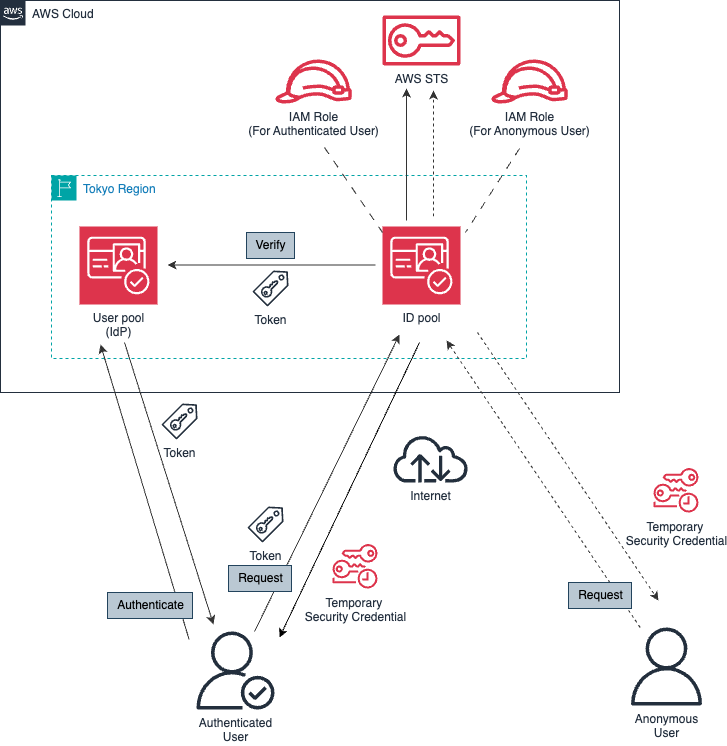
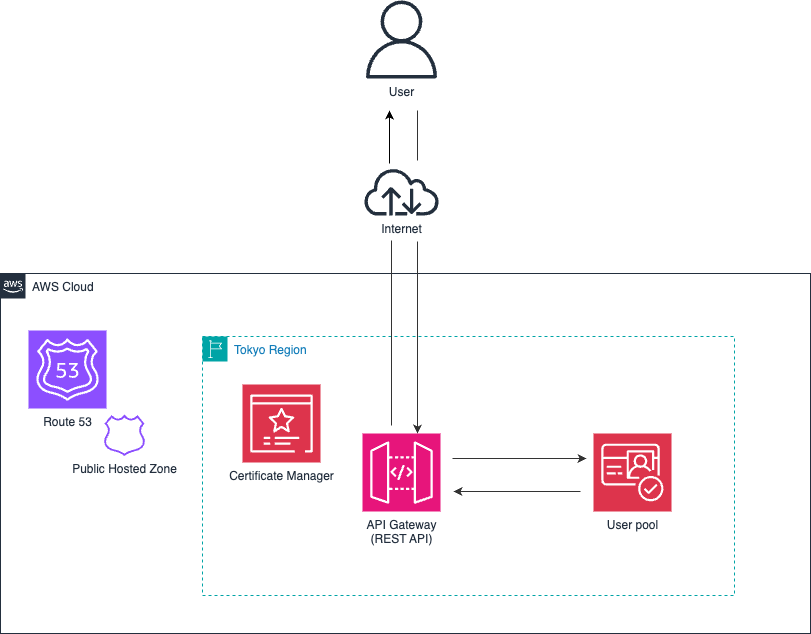

=====================================================================
【初心者向け】Amazon Cognito について整理する
=====================================================================
* `詳細 <>`_

=====================================================================
構成図
=====================================================================
ID pool
---------------------------------------------------------------------

User pool
---------------------------------------------------------------------

=====================================================================
デプロイ - Terraform -
=====================================================================

作業環境 - ローカル -
=====================================================================
* macOS Sequoia ( v15.7.2 )
* Visual Studio Code 1.106.3
* Rain v1.24.2
* aws-cli/2.33.12

フォルダ構成
=====================================================================
* `こちら <./folder.md>`_ を参照

前提条件
=====================================================================
* *AdministratorAccess* がアタッチされているIAMユーザーを作成していること
* 実作業は *envs* フォルダ配下の各環境フォルダで実施すること
* 以下コマンドを実行し、*admin* プロファイルを作成していること (デフォルトリージョンは *ap-northeast-1* )

.. code-block:: bash

  aws login --profile admin

.. code-block:: bash

  sed -i '' '/^\[profile admin\]/a\
  credential_process = aws configure export-credentials --profile admin
  ' ~/.aws/config

事前作業(1)
=====================================================================
1. 各種モジュールインストール
---------------------------------------------------------------------
* `GitHub <https://github.com/tyskJ/common-environment-setup>`_ を参照

事前作業(2)
=====================================================================
1. デプロイ用バケット作成
---------------------------------------------------------------------
.. code-block:: bash

  aws s3 mb \
  s3://cfn-working \
  --profile admin 

.. note::

  * バケット名は、全世界で一意である必要があります
  * 作成に失敗した場合は、バケット名を修正してください

実作業 - ローカル -
=====================================================================
.. note::

  * 試したい方をデプロイしてください

* `ID pool` 検証用スタックデプロイ
---------------------------------------------------------------------
.. code-block:: bash

  rain deploy id-pool.yml ID-POOL \
  --s3-bucket cfn-working \
  --config config/id-pool-parameter.yml \
  --profile admin

.. note::

  * S3バケット名は必要に応じて修正してください

* `User pool` 検証用スタックデプロイ
---------------------------------------------------------------------
.. code-block:: bash

  rain deploy user-pool.yml USER-POOL \
  --s3-bucket cfn-working \
  --config config/user-pool-parameter.yml \
  --profile admin

.. note::

  * S3バケット名は必要に応じて修正してください

後片付け - ローカル -
=====================================================================
1. 検証用スタック削除
---------------------------------------------------------------------
.. code-block:: bash

  rain rm ID-POOL --profile admin
  rain rm USER-POOL --profile admin

.. note::

  * 試した方を削除してください

2. デプロイ用バケット削除
---------------------------------------------------------------------
.. code-block:: bash

  aws s3 rm --recursive s3://cfn-working --profile admin
  aws s3 rb s3://cfn-working --profile admin

.. note::

  * S3バケット名は必要に応じて修正してください